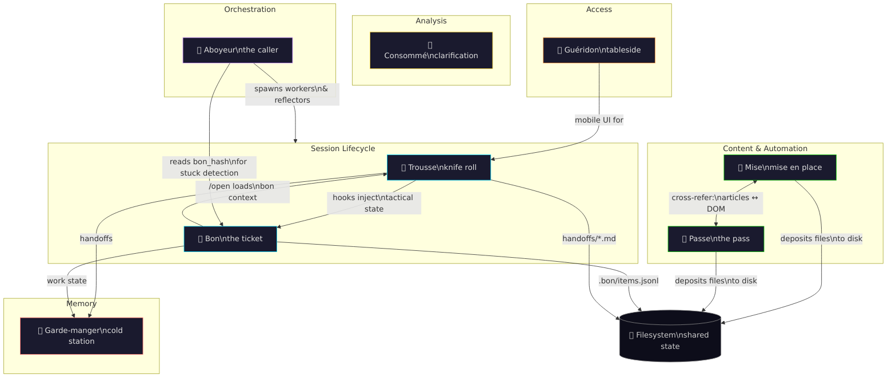

# Batterie de Savoir

*Kitchen tools for knowledge work.*

As part of the general process of adapting ways of working to make good use of AI, I've found, like a lot of people, that tools which are supposedly for *coding* turn out to be fantastic for knowledge work. As I've gotten more into this, I found I've needed to build various tools to help me work more efficiently in the knowledge kitchen (::vomit-emoji::) and I've decided to release my Batterie de Savoir. 

In a professional kitchen, the *batterie de cuisine* is the complete set of equipment — every pan, every knife, every mould — that lets a brigade turn raw ingredients into a service. This is the same idea applied to AI-assisted knowledge work: a set of tools, each with a defined station, that turn raw context into clear thinking.

And context, like ingredients, has a cycle of preparation and waste, of filtering and freshness. An overstuffed or untidy station can be confusing or even dangerous for the AI working it. There's a bit in Ratatouille where Colette threatens the messy Linguini/Remy, "I'll make this easy to remember. Keep your station clear [or I will kill you](https://www.youtube.com/watch?v=lZdEZ0QDzqk)."

And just as we hear the ghost of chef Gusteau talking us through the [brigade de cuisine](https://en.wikipedia.org/wiki/Brigade_de_cuisine) — this document takes you through the set of tools I've developed - each one named for a kitchen role, each with a single responsibility, all coordinated through the same protocols. 

If there's an aspiration, it is to acquire stars for the most pretentious dishes on Github. Much like a real Michelin chef. 

## The Brigade

GENERATED:brigade-table:START
| Tool | Station | Description | Status |
|------|---------|-------------|--------|
| [**Bon**](tools/bon) | The ticket | GTD-flavoured work tracking — outcomes, actions, tactical steps | ⚡ Stable |
| [**Trousse**](tools/trousse) | The knife roll | Skills, hooks, and session lifecycle for Claude Code | ⚡ Stable |
| [**Garde-manger**](tools/garde-manger) | The cold station | Persistent, searchable memory across sessions | ⚡ Stable |
| [**Jeton**](tools/jeton) | The token | Google OAuth token management for the suite | ⚡ Stable |
| [**Mise en Space**](tools/mise) | Mise en place | Content fetching and prep from Google Workspace and the web (MCP) | 🔧 Beta |
| [**Passe**](tools/passe) | The pass | Fast browser automation via Chrome DevTools Protocol | 🔧 Beta |
| [**Consommé**](tools/consomme) | Clarification | BigQuery data analysis — messy data in, clear insights out | 🧪 Alpha |
| [**Plongeur**](tools/plongeur) | The dishwasher | Streamlit data exploration UI — makes consommé accessible to non-technical users | 🔧 Beta |
| [**Todoist GTD**](tools/todoist-gtd) | The commis | Todoist integration with GTD coaching — human-owned tasks and deadlines | ⚡ Stable |
| [**Aboyeur**](tools/aboyeur) | The caller | Multi-session orchestrator — alternates workers and reflectors | 🧪 Alpha |
| [**Guéridon**](tools/gueridon) | Tableside trolley | Mobile web UI for Claude Code | 🔧 Beta |
GENERATED:brigade-table:END

Together they address knowledge work from different angles: bon tracks *what needs doing*, trousse gives each session *the right tools and memory of the last*, garde-manger provides *searchable ancestral memory*, jeton handles *OAuth tokens* so the Google-facing tools don't have to, mise preps *content from the outside world*, passe *automates the browser*, consommé *clarifies raw data*, aboyeur *coordinates multiple sessions* so no single context window has to hold everything, and guéridon *untethers a session from the desk*.

## Design Principles

**Files are the protocol.** Handoffs are markdown. Work items are JSONL. Tactical state is a text file injected by a hook. There's no IPC, no daemon, no shared database between tools. Everything communicates through the filesystem. This is the deepest design choice in the batterie, and it's why knowledge work and code turn out to be so compatible — they're both folder-native ways of thinking. Every instinct a human has for organising files, naming things, putting stuff in the right place — all of it transfers directly. The filesystem *is* the shared state.

**Token-efficiency is a first-class constraint.** Context is the kitchen's most precious ingredient — expensive, finite, and ruined by clutter. Mise deposits fetched content to disk rather than spraying it into context. Passe returns structured JSON summaries, not raw HTML. Bon's skill says "never run `bon list` via Bash — Read the file instead" because formatted terminal output bloats context. Every tool treats the context window like a clean station — only what's needed, prepped and portioned, nothing left out to spoil.

**Memory is layered, not monolithic.** A good kitchen keeps its stock, its jus, and its reductions in different vessels for different purposes. The batterie has five memory layers: tactical steps (within a single action), bon items (project-level outcomes), handoffs (session-to-session baton), garde-manger (searchable history across all sessions), and MEMORY.md (cross-project patterns learned over time). Each layer has different durability, scope, and cost. A fresh session reaches for the handoff. A stuck session searches garde-manger. A recurring pattern gets distilled into MEMORY.md. The right context at the right concentration.

**Filleting knives, not cleavers.** Each tool has a tiny verb surface. Passe has ~20 verbs. Bon has 18 commands. Mise has 3 — search, fetch, create. The tools are narrow enough that an agent can hold the entire interface in working memory without re-reading the docs. This is the opposite of the "batteries-included framework" approach. It's a brigade of specialists, each with a single station.

**Tools referee themselves.** Passe's README says "for clean article extraction, use mise." Mise's skill says "for DOM-faithful extraction, use passe read." Consomme's skill says "for Workspace content, use mise." Every tool includes explicit "when NOT to use this" guidance — pointing the agent to the right station instead. Most tools only advocate for themselves. In a brigade, the stations direct traffic.

**Every tool ships with its own training.** Each tool in the batterie is paired with a skill — a behavioural document that teaches the agent not just *what* the tool can do, but *how to think with it*. Bon's skill teaches the draw-down workflow and brief quality. Passe's skill teaches scout-then-act. Mise's skill teaches the file-email-meaning loop. The heavy, token-expensive knowledge — patterns, gotchas, when to deviate from the recipe — lives in the skill, loaded on demand, rather than baked into the tool's output or crammed into the system prompt. The tool stays small; the skill carries the judgement. You fit the agent to the tooling by giving it the manual at the moment it picks up the knife.

**The human stays in the kitchen.** The work tracker uses GTD vocabulary — outcomes, next actions, waiting-for — rather than Agile tickets and sprints. This isn't cosmetic. GTD directs attention by *readiness* ("what can I act on right now?") rather than *urgency* ("what's blocked? what's overdue?"). The aboyeur pages the human only when genuinely stuck, not for routine approval. The tools are designed so the human can step away from the pass and come back to find the station in order — or step in and take the tongs when the moment calls for it. Though honestly, which one of us is Remy and which one is Linguini changes by the hour.

---

[Getting started](getting-started) · [Principles (expanded)](principles) · [For agents](for-agents)
